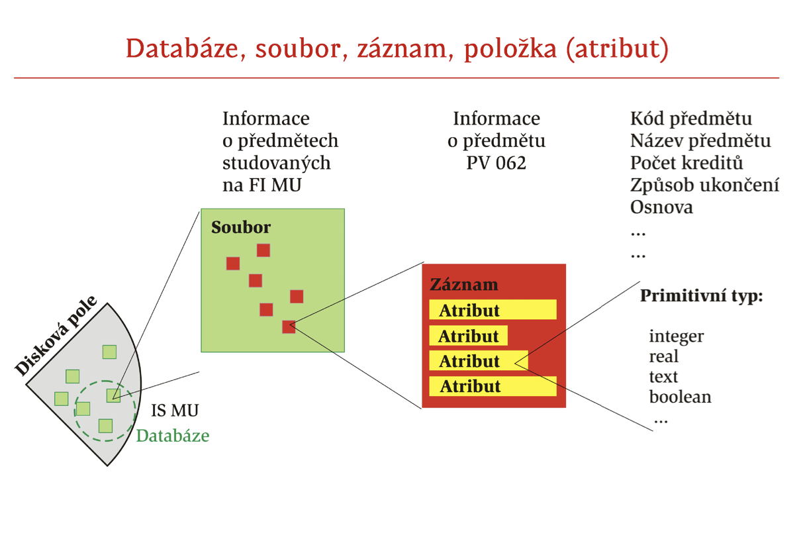
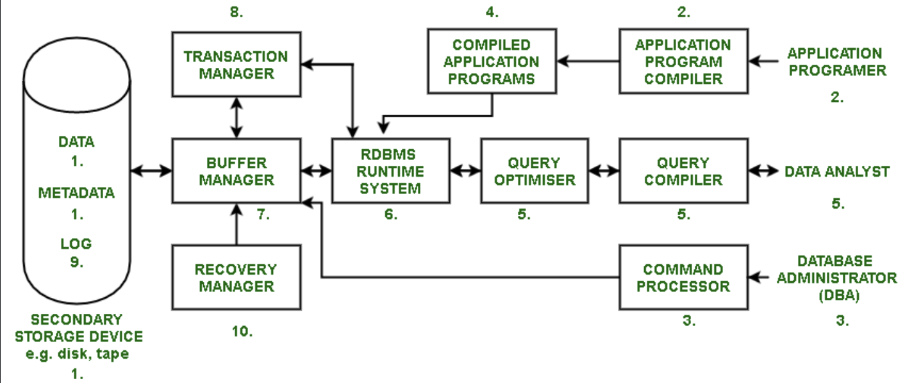

# Databáze
> Principy ukládání dat, databáze a souborové systémy. Kódování a komprese dat. Architektura relačních databází, dotazovací jazyk SQL a jeho části (definice, manipulace, transakce). Jazyk definice datového schématu, DDL. Jazyk manipulace s daty, DML. Relační algebra, integritní omezení, řízení transakcí. Indexování, hašování. Příklady z praxe pro vše výše uvedené. ([PV003](https://is.muni.cz/auth/el/fi/jaro2022/PV003/um/) || [PV062](https://is.muni.cz/auth/of/fi/PV062/jaro2021/slides-pv062.pdf))

## Principy ukládání dat, databáze a souborové systémy

Dáta sú informácie, ktoré boli preložené do formy (binárnej digitálnej formy) efektívnej na prenos alebo spracovanie.

Ukladanie dát sa týka mechanizmov a technológií používaných na ukladanie, správu a organizáciu dát.
Efektívne ukladanie údajov je kľúčové pre rýchle vyhľadávanie, škálovateľnosť a zachovanie integrity údajov.

Data se v praxi ukládají přímo do souborového systému, nebo do databáze (relační, dokumentové, grafové...).

### Typy ukladania údajov:
1. **Primárne úložisko (RAM, cache)**: Rýchla, nestála pamäť používaná pre aktívne procesy.
2. **Sekundárne úložisko (pevné disky, SSD -- magneticke disky a flash)**: Trvalé, dlhodobé úložisko.
3. **Terciárne úložisko (páskové jednotky, opticke disky - CD/DVD)**: Používa sa na archiváciu a zálohovanie. 

### Súborové systémy - file systems:
- spôsob organizácie dát vo forme súborov a adresárov, tak aby k nim bolo možné ľahko pristupovať
- e.g. FAT (Microsoft), ext* (Linux), HFS+ (Apple)

**Hierarchická štruktúra:** Súbory usporiadané do adresárov/priečinkov.\
**Operácie so súbormi:** Čítanie, zápis, mazanie a úprava súborov.\
**Atribúty súboru:** Povolenia, veľkosť, dátum vytvorenia/úpravy.

Relační databázové systémy byly vyvinuty kvůli zvládnutí následujících problémů při zpracování souborů v tradičních operačních systemech:
- redundance a inkonsistence dat - duplicitní dat v různých souborech
- problémy s přístupy k datům - složité metody pro přístup k datům
- izolace dat – různé soubory a formáty
- problémy s integritou 
- jedinečnost (atomicita) aktualizací
- současný přístup více uživatelů
- bezpečnostní problémy

Databázové systémy mají tedy následující vlastnosti:
1. Struktury datových souborů jsou odděleny od aplikačních (uživatelských) programů.
2. Přístup k datům je možný jen prostřednictvím programů databázového systému.
3. Data je možné vyhodnotit jakýmkoliv způsobem.
4. Je umožněn přístup více uživatelů současně a vyřešena ochrana dat před zneužitím.

### Databázy:
- databáza usporiadaná množina dát, ktorá je usporiadaná pre jednoduchý prístup, správu a vyhľadávanie (zdroj: chatgpt)
- databáza je nástroj na zhromažďovanie a usporiadanie informácií (zdroj: Microsoft)
- je navrhovaná pre použitie **aplikačnými systémami**
- databázy sa v počítači (na vonkajších pamätiach) uchovávajú ako kolekcia pomenovaných množín dát — súborov, (files):
- **súbor** je z pohľadu aplikácie pomenovanou kolekciou dát uloženou na vonkajšej pamäti (zobrazuje sa do blokov/stránok)
- súbor je vnútorne štrukturovaný na **záznamy** (records), ktoré sú štrukturované na **atribúty** (attributes)
  - **záznam** je kolekcia atribútov (položiek) charakterizujúcich istý objekt

- databáza je spravovaná SRBDMS (Systémom riadenia relačných databáz) — RDBMS (Relational Database Management System)
  - je nezávislý na operačnom systéme, môže využívať služby operačného systému, napr. súborový systém
  - býva súčasťou *middleware* - funkčná vrstva medzi OS a aplikáčnými systémami



- **Relačné databázy:** Usporiadajte údaje do tabuliek s preddefinovanými vzťahmi (napr. MySQL, PostgreSQL, Oracle).
- **NoSQL databázy:** Flexibilné databázy bez schém vhodné na spracovanie veľkého množstva neštruktúrovaných údajov (napr. MongoDB, Cassandra).
- **Ukladanie kľúč-hodnota, sklady dokumentov, databázy grafov:** Rôzne typy založené na dátovom modeli. 

#### Relačný model dát
Relační model je databázový model založený na predikátové logice. \
Jeho základním předpokladem je, že všechna data jsou reprezentována jako matematické n-ární relace. \
Na datech se operuje pomocí relační algebry nebo relačního kalkulu, přičemž obě mají stejnou vyjadřovací sílu. \
Databáze organizovány pomocí relačního modelu se nazývají relační databáze a sestávají z několika relací.

- **atribút/entita** - vlastnosť objektu, napr. meno, vek, pohlavie - je popísaný nejakou **hodnotou**, ktorá by mala byť atomická/nedeliteľná a má dátový typ
- **doména** - množina hodnôt, ktoré môže nadobúdať atribút, napr. doména pohlavia je množina {M, F}
- **relácia** 
  - podmnožina kartézskeho súčinu n domén, resp. n-tíc, kde každá n-tica je usporiadaná množina hodnôt, napr. relácia študentov má atribúty meno, vek, pohlavie
  - relace nesmí obsahovat duplicitní n-tice (jedná se o množinu) 
  - V databázi je relace vizuálně znázorněná tabulkou, kde n-tice představují její řádky a atributy její sloupce.
- Kolekce více tabulek, jejich funkčních vztahů, indexů a dalších součástí tvoří **relační databázi**
- Tabulka = forma znázornění relace

Příklad:
```
z = {   
        (1001, Jana Oblá, grafika, 25000),
        (2222, Petr Rychlý, prog, 35000),
       	(2552, Jiří Novotný, prog, 35000),
        (3535, Petra Kabelová, sítě, 30000),
        (8000, Jan Nevěřil, teorie, 30000) 
 }
```
Název relace: \
Atributy: učo, jméno, katedra, plat\
Domény: Dučo = {1001, 2222, 2552, 3535, 8000}, Djméno = {…}, Dkatedra = {…}, Dplat = {…}\
Objekt (n-tice): (Dučo, Djméno, Dkatedra, Dplat)\
Relace z je tedy podmnožinou kartézského součinu Dučo × Djméno × Dkatedra × Dplat. \
Příkladem konkrétní n-tice je třeba (1001, Jana Oblá, grafika, 25000).

Relace se promítne do databáze tak, že domény jsou datové typy sloupců a tabulka (složená ze sloupců) obsahuje pouze takové kombinace hodnot (řádky), jaké jsou v relaci.
relace nesmí obsahovat duplicitní n-tice (jedná se o množinu). V databázi je relace vizuálně znázorněná tabulkou, kde n-tice představují její řádky a atributy její sloupce.

#### Relační algebra
Relační algebra je čistý procedurální dotazovací jazyk. \
Pro relační operace používáme relační algebru skládající se z 
- **množinových operací** (ale pro sjednocení, rozdíl a průnik musí být relace kompatibilní, i.e., mít stejnou hlavičku)
- **projekce** - i.e. výběr sloupců
- **selekce** - i.e. WHERE
- **přejmenování** - AS
- **spojení/join/součin relací** - JOIN
- **seskupení a agregace** - GROUP BY, AVG(...)...
...jednotlivé operace tedy odpovídají dotazovacímu jazyku SQL.

Důležitá je uzavřenost nad relacemi: každá operace na vstupu očekává relaci, a vrací opět relaci

Existují dotazy, které nejsme schopní vyjádřit relační algebrou, třeba tranzitivní uzávěr.

*Tranzitivní uzávěr nad relací získáme tak, že se díváme na prvky množiny v relaci. Pokud je `a` v relaci s `b` a `b` v relaci s `c`, pak (aby bylo dosaženo tranzitivity) tranzitivní uzávěr obsahuje relaci `a` s `c`.*

##### Řízení transakcí.
Databázová transakce je skupina příkazů, které převedou databázi z jednoho konzistentního stavu do druhého.

Transakce v RDBMS mají ACID vlastnosti
- **Atomicity** - skupina příkazů transakce brána jako jednotka; provedou se všechny, nebo žádný
- **Consistency** - po vykonání transakce ke db v konzistentním stavu, není porušeno žádné integritní omezení
- **Isolation** - transakce je izolovaná od ostatních transakcí, je možné nastavit úrovně transakce, dle toho může transakce skončit chybou (pokud došlo k modifikaci stejného objektu, jaký modifikovala jiná transakce), nebo se využijí zamykací mechanismy
- **Durability** - data jsou po vykonánání transakce persistentně uložena

Transakce se potvrzují příkazem `COMMIT`, vrací příkazem `ROLLBACK` na stav před započením transakce, či po poslední `SAVEPOINT`

#### Architektura relačních databází [RDBMS](https://www.geeksforgeeks.org/rdbms-architecture/)



1. Všetky údaje, údaje o údajoch (metadáta) a protokoly sú uložené v sekundárnych úložných zariadeniach (SSD), ako sú disky a pásky. Programy, ktoré sa používajú na vykonávanie každodenných úloh podniku, sa nazývajú aplikačné programy. Tieto programy poskytujú funkcie pre každodenné operácie podniku. Sú napísané v jazykoch vysokej úrovne (HLL) ako Java, C atď., ktoré sa spolu s SQL používajú na komunikáciu s databázami.

2. RDBMS má kompilátor, ktorý konvertuje príkazy SQL do jazyka nižšej úrovne, spracuje ho a uloží do sekundárneho úložného zariadenia.

3. Úlohou správcu databázy (DBA) je nastaviť štruktúru databázy pomocou príkazového procesora. DDL je skratka pre Data Definition Language a používa ho DBA na vytváranie alebo rušenie tabuliek, pridávanie stĺpcov atď. DBA používa aj iné príkazy, ktoré sa používajú na nastavenie obmedzení a riadenia prístupu.

4. Aplikační programátori kompilujú aplikácie pomocou kompilátora a vytvárajú spustiteľné súbory (skompilované aplikačné programy) a potom ukladajú údaje na sekundárnom úložnom zariadení.

5. Úlohou Data Analyst je používať Query Compiler a Query Optimizer (používa relačné vlastnosti na vykonávanie dotazov) na manipuláciu s údajmi v databáze.

6. RDBMS Run Time System vykonáva skompilované dotazy a aplikačné programy a tiež spolupracuje so správcom transakcií a správcom vyrovnávacej pamäte.

7. Buffer Manager dočasne ukladá údaje databázy do hlavnej pamäte a používa stránkovací algoritmus, aby bolo možné vykonávať operácie rýchlejšie a spravovať miesto na disku.

8. Transaction Manager sa zaoberá princípom buď úplne vykonať úlohu, alebo ju nerobiť vôbec (vlastnosť Atomicity). napr. Predpokladajme, že osoba menom Geeks chce poslať peniaze svojej sestre. Pošle peniaze a medzi tým sa zrúti systém. V žiadnom prípade by sa nemalo stať, že poslal peniaze, ale sestra ich nedostala. Toto rieši manažér transakcií. Transakčný manažér buď vráti peniaze Geeksovi, alebo ich prevedie svojej sestre.

9. Log je systém, ktorý zaznamenáva informácie o všetkých transakciách, takže vždy, keď dôjde k zlyhaniu systému (porucha disku, vypnutie systému kvôli výpadku napájania atď.), je možné čiastkové transakcie vrátiť späť.

10. Recovery Manager prevezme kontrolu nad systémom, aby po zlyhaní dosiahol ustálený stav. Recovery Manager berie do úvahy protokolové súbory a ruší čiastkové transakcie a odráža celú transakciu v databáze.

RDBMS může obsahovat techniky pro administraci přístupových práv (omezení určitých operací, viditelnost dat až na row/column level...).

Pokud se otázkou myslí *Z jakých prvků se relační databáze skládají*, pak by bylo fajn mluvit o tabulkách, sloupcích, jazyku SQL pro jejich definici (DDL, data definition language) a manipulaci (DML, data manipulation language), indexech, (materializovaných) views...

### Databáza vs. súborový systém:
**Organizácia údajov:** Databázy používajú štruktúrovaný, organizovaný prístup, zatiaľ čo súborové systémy sa spoliehajú na adresáre a súbory.\
**Získavanie údajov:** Databázy ponúkajú pokročilé vyhľadávanie a indexovanie pre efektívne vyhľadávanie.\
**Dátové vzťahy:** Databázy riadia vzťahy medzi dátovými entitami a zabezpečujú integritu dát.

#### Souborový systém
- menší systémové nároky, jednodušší
- náročné zajištění konzistence, nutnost řešení zamykání souborů, problematický transakční přístup
- náročnější správa přístupových práv
- nutnost konzistentně řešit formát dat
- horší čitelnost & dokumentovatelnost datového modelu
- operační systém slouží jako abstrakce pro aplikace, umožňuje jednotný přístup k různým souborovým systémům

- pro aplikace se hodí na ukládání velkých souborů (pdf, obrázky, video, statická stránka, pokud tedy nepoužijeme CDN), které je nepraktické uchovávat v databázi. Je nutné dávat pozor, abychom neposkytli přístup jinam než chceme.

#### Databázový systém
- nezávislý na aplikaci, jednotné rozhraní pro všechny
- snadné zabezpečení, konzistence, souběžný přístup
- snadná čitelnost, dokumentovatelnost
- relační systémy korelují s ERD
- deklarativní přístup
- optížná implementace složitějších struktur (záleží však na systému)
- O relačních databázích platí, že umožňují ACID [transakce](./5_databaze.md#řízení-transakcí).

### Normalizácia a indexovanie:
**Normalizácia:** Proces minimalizácie redundancie a závislosti organizovaním polí a tabuliek databázy.

#### 0. NF
žiadne obmedzenia

#### 1. NF
všetky atribúty tabuľky už nie sú deliteľné -> atomické

#### 2. NF
1NF + každý nekľúčový atribút je funkčne závislý od celého kľúča, e.g.:

Relácia:\
Študent (primárny kľúč)\
Kód predmetu (primárny kľúč)\
Názov predmetu\
Známka

nie je v 2NF, pretože názov predmetu nie je závislý od celého kľúča, ale len od jeho časti (a to od kódu predmetu).
Na prevod do 2NF by bolo potrebné ju rozdeliť na dve, pričom z pôvodnej relácie by sme odstránili názov predmetu a vytvorili by sme novú reláciu:\
Kód predmetu (primárny kľúč)\
Názov predmetu

#### 3. NF
2NF + žiaden nekľúčový atribút nie je tranzitívne funkčne závislý od primárneho kľúča == všetky neklúčové atribúty musia byť navzájom nezávislé.

Napríklad relácia:

Kód predmetu (primárny kľúč)\
Názov predmetu\
Číslo učiteľa\
Meno učiteľa

nie je v tretej normálne forme, pretože meno učiteľa je závislé od čísla učiteľa. Prevod by opäť pozostával z dekompozície

#### Indexování
Index je dátová štruktúra, ktorá poskytuje mechanizmus rýchleho vyhľadávania na nájdenie konkrétnych riadkov v tabuľke na základe hodnôt v jednom alebo viacerých stĺpcoch. Vytváraním indexov môžu databázy výrazne zlepšiť efektivitu operácií vyhľadávania, filtrovania a triedenia.

Zvyšuje rýchlosť získavania údajov vytváraním indexov v stĺpcoch.
Index slouží ke zrychlení/zefektivnění častých dotazů nad tabulkou. Dotazy obsahující zvolený sloupec (či jejich kombinaci) budou rychlejší.

```sql
CREATE INDEX my_index ON Products (Price)
```

Dva základní typy indexů:
- **Řazené indexy** – vyhledávací klíče jsou uspořádané
- **Hešovací indexy** – vyhledávací klíče jsou rovnoměrně rozprostřeny po
adresovacím prostoru hešovací funkce

Pro indexy se mohou používat 
1. konvenčné indexy
- **hustý index** – pro každý záznam v tabulce je vytvořen záznam v indexu
- **řídký index** – pro každý blok v tabulce je vytvořen záznam v indexu -> pre nájdenie záznamu K je potrebné najprv nájsť indexový záznam s největším vyhledávacím klíčem menším než K a potom v ňom vyhľadať záznam

tradiční indexy jako v knihách, odkazy na řádky s danou hodnotou, je možné dělat více úrovní indexů, používat různá indexová uspořádání...
2. indexy s usporiadaním (např. B-stromy)
- **B+ stromy** - najcastejsie - každý uzel obsahuje odkazy na uzly níže, nebo hodnoty (jedná se o listový uzel). Hodnoty jsou v listech vzestupně uspořádány, uzly v sobě mají i informace o intervalech daných odkazů/hodnot, listy jsou provázané.
    
- **R stromy** - podobné jako B+, ale jsou vícedimenzionální, ve 2D fungují jako obdélníky. Data jsou v listových uzlech stromu. Rodič uzlu zahrnuje všechny své potomky (ve 2D jde o větší obdélník, který obsahuje potomky). Ideální je, aby zabíraly rodičovské obdélníky co nejméně prostoru - rodič totiž jako index redukuje oblast nutnou k prohledání (říká *hledej ve mně!*).
    
    
3. bitové indexy 
Pokud je počet unikátních hodnot odkazovaného atributu malý, může se sestavit bitový
vektor pro každou hodnotu a postavit index z těchto vektorů > matice bitů.

3. hašovací indexy
Pro získání jednoduché hodnoty velkých dat -> Transformace klíče na adresu za pomoci hashovací funkce.


#### Hašování

**Cílem hašování je převést vstupní data libovolné délky na výstup jednotné délky (fixed-length řetězec, nebo číslo), hash.** Z heshe by nemělo být možné odvodit vstup (**jednosměrnost**), pro každý vstup bychom měli být schopni deterministicky (vstupem jsou pouze data) určit jediný hash. Zároveň může být (dle použití) cílem minimalizovat riziko kolize, tedy že dva vstupy mají stejný hash (nelze se tomu ale vyhnout, protože musíme být schopni mapovat nekonečno možných vstupů na omezený počet výstupů daný délkou). Dle použití může být také důležité, aby podobné vstupy měli zásadně rozdílné heše, aby bylo možné snadno odhalit drobnou (záměrnou či nechtěnou) modifikaci vstupu. Pro prolamování hašů se použávají rainbow tables, obsahující pro daný algoritmus známé vstupy a jejich haše.

Hašování se používá pro zajištění integrity dat (certifikáty, checksum), rychlé porovnávání dat (HashMap), porovnávání dat se znalostí pouze heše (uchovávání hash hesel v databázi, Argon2).

**Bezkoliznost**
- **slabá** - pro vstup A nejsme schopni v rozumném čase nalézt rozdílný vstup B, který by měl stejný hash
- **silná** - nejsme schopni v rozumném čase najít libovolné dva rozdílné vstupy se stejným hashem 

Pro různé účely používáme různé algoritmy, jde o balanc rychlosti (u hesel může je kýžená pomalost) a bezpečnosti/pravděpodobnosti kolize.
- **MD5** - relativně rychlý, není bezpečný (lze rychle najít kolize i na běžném počítači). 
- rodina Secure Hashing Algorithm, za bezpečnou se aktuálně považuje **SHA-2** (SHA256, SHA512, SHA-384...)
- **Argon2** - v současnosti doporučovaný pro hašování hesel
- hašem (hloupým, ale rychlým) může být třeba i délka vstupu, modulo, součet ascii hodnot znaků... (nazývá se [Cyclic redundancy check](./dev_3_bezpecny_kod.md#notes))

Hashovanie sa používa aj pre indexovanie -> **hashovacie indexy**.
1. **statické hashovanie**
- hešovací index organizuje vyhledávací klíče spolu s ukazateli na záznamy v hešovací souborové organizaci
- hesovaci souborova organizace využíva buckets (kybliky) ako základní úložnou jednotkou obsahující jeden nebo více záznamů
- V hešovací souborové organizaci získáme kyblík, kde je hledaný záznam uložen, přímo z jeho vyhledávacího klíče pomocí hešovací funkce
- (-) Ve statickém hešování mapuje hešovací funkce vyhledávací klíče na pevnou množinu adres kyblíků.

2. **dynamické hashovanie**
- Vhodné pro databáze, které mění svoji velikost
- Umožňuje modifikovat hešovací funkci
- Rozšiřitelné hešování

### Zálohovanie a obnova:
**Dôležitosť:** Pravidelné zálohovanie zaisťuje obnovu dát v prípade zlyhania systému alebo poškodenia dát.\
**Stratégie:** Úplné, prírastkové a rozdielové zálohy.

### Bezpečnosť údajov:
**Kontrola prístupu:** Obmedzenie prístupu na základe rolí a povolení používateľa.\
**Šifrovanie:** Ochrana citlivých údajov pomocou techník šifrovania.

### Trendy ukladania údajov:
**Cloud Storage:** Ukladanie údajov na vzdialených serveroch prístupných cez internet.\
**Veľké údaje:** Spracovanie veľkých a zložitých súborov údajov nad rámec tradičných databázových možností.\
**Blockchain:** Distribuované a bezpečné ukladanie dát s decentralizovanou kontrolou.

### Výzvy a budúce smerovanie:
**Škálovateľnosť:** Spracovanie rastúceho množstva údajov.\
**Ochrana osobných údajov:** Riešenie problémov súvisiacich s používateľskými údajmi.\
**Distribuované databázy:** Efektívna správa údajov na viacerých miestach.


## Kódování a komprese dat
**Kódování** - převod dat z jednoho formátu do jiného, např. z textu do binární podoby.\
**Komprese** - proces identifikace a odstranovani redundance (nadbytetného mnozstvi informace) v datec

Techniky s cílem transformace informací do formátu, který je efektivní na ukládání či přenos. 

**Bezztrátová komprese** - z komprimovaných dat jsme schopni plně rekonstruovat původní data (e.g. png, zip)  
**Ztrátová komprese** - část komprimovaných dat je ztracena (e.g. jpeg, mp3), ale jsme schopni dosáhnout větší komprese

Fáze komprese:
1. **Modelovanie** = hľadanie a popis redundancie vo vstupných dátach
2. **Kódovanie** = generovanie výstupných komprimovaných dát

### Vybrané metody 
**Základné**
- Brailovo písmo

**Statistické**
- [Huffmanovo kódování](https://www.youtube.com/watch?v=iEm1NRyEe5c) - na základě frekvence určíme pro každý symbol kódovací znak, kód má minimální redundanci, proměnlivá délka kódu symbolů
    1. seřadíme znaky podle frekvence do prioritní fronty ve formě uzlů, u každého máme uvedenou frekvenci
    2. vyjmeme 2 uzly s nejmenšími frekvencemi a spojíme je do uzlu, který bude mít frekvenci rovnou součtu frekvencí. Takto vytváříme stromovou strukturu. Opakujeme, dokud nemáme 1.
    3. procházíme stromovou strukturu od kořene, levé větve značíme `0`, pravé `1`, cesta od kořene po uzel unikátně identifikuje symbol a kombinací `0` a `1` získáme kód pro daný symbol
    
- [Shannon-Fano](https://www.youtube.com/watch?v=dJCck1OgsIA) - podobný jako Huffman, nemusí být optimální, ale jdeme od kořene a sekvenci symbolů seřazených dle frekvence dělíme na poloviny (+-, sčítáme frekvence a při překročení poloviny dělíme), Při každém dělení značíme `0` a `1`. Jakmile je ve vytvořené polovině jen 1 symbol, už není co dělit.

**Slovníkové**\
Vytváří se slovník dříve přečtených řetězců výstupem jsou indexy do slovníku.
- **LZ77 (Lempel-Ziv)**
    - Jako slovník se používá jistá zpracovaná část zdrojového textu, vybíraná klouzajícím oknem, kódují se v něm obsažené řetězce proměnné délky.
    - Výstupem je trojice:
      - ukazatel počátku vzoru ve slovníku
      - délka vzoru
      - kódové slovo příštího symbolu za kódovým textem
- **LZ78 (Lempel-Ziv)**
  - Používá se samostatný dynamicky vytvářený slovník.
  - Výstupem je dvojice:
    - index vzoru ve slovníku
    - kódové slovo příštího symbolu za kódovým 
- **LZW (Lempel-Ziv-Welch)**
  - Používá se samostatný dynamicky vytvářený slovník.
  - Potenciální elementy slovníku jsou v kódové knize přednastaveny.
  - Výstupem je jediný údaj – index vzoru ve slovníku.

    
## Dotazovací jazyk SQL a jeho části (definice, manipulace, transakce)
Dotazovací jazyk SQL vychází z [relační algebry](./5_databaze.md#relační-algebra). 

Obsahuje konstrukty pro definici datového schématu, pro manipulaci s daty a pro transakční zpracování (viz další sekce).

V některých systémech má prostředky pro procedurální programování, PL/SQL (třeba Oracle).

SQL může obsahovat triggery, tedy dodatečné akce, které se mají vykonat při určitém příkazu (INSERT, UPDATE, DELETE). Používají se třeba pro udržování history table, nebo pro aktualizaci `updated_at`, pokud to nepodporuje daný RDBMS.

Při práci s SQL používáme prepared stetements, abychom zabránili SQL injection.

## Vyhodnocení dotazů
1. **Dotaz**\
Běžné zadání dotazu do SQL - např. SELECT * FROM courses WHERE …
2. **Syntaktická a sémantická kontrola (sestavení stromu)**\
Parser přetvoří dotaz do interní reprezentace ve formě stromu a provede normalizaci dotazu (viz. CNF - Konjunktivní normální forma). V téhle fázi se kontroluje cache, pokud záznam existuje, přeskočí se na vyhodnocení dotazu.\
Syntax - skladba dotazu - správné uspořádání příkazů\
Sémantika - význam dotazu - kontroluje se např. jestli odkazované sloupce existují
3. **Logický plán (+ úpravy)**\
Vezme strom dotazu, převede ho do relační algebry, vyhodnotí používané datové typy a operátory a pokusí se optimalizovat strom pro větší efektivitu logických operátorů (AND, OR, IN, JOIN…). Jedná se o vyšší úroveň zpracování (z pohledu abstrakce).
IN operátor se nahrazuje součinem (přirozeným).
4. **Fyzický plán**\
Vezme logický plán a nahradí jednotlivá data a prvky konkrétní implementací databázového systému na nižší úrovni. Při generování fyzického plánu se bere v potaz cena jednotlivých operací (čtení z disku, ukládání do RAM), počítá se množství postihnutých záznamů, čas provedení apod. Na základě tohoto vyhodnocení vznikne tzv. “cena” dotazu a pokud se zvažovalo více variant, vybere se ta s nejnižší cenou.
5. **Vyhodnocení**\
Připraví se a vyhodnotí zdrojový kód dotazu, který vrací konkrétní set hodnot.


## Jazyk definice datového schématu, DDL.

*Note: různé RDBMS podporují různé typy. Třeba TEXT v základu SQL definován není, ale v praxi je použití VARCHAR2 s fixní délkou příliš nepraktické, proto ho tu uvádím*

1. Tvorba tabulky

```sql
/* Blokový koment */
-- Inline koment
CREATE TABLE Products (
    id          INT PRIMARY KEY, --třeba u pg je možné použít SERIAL, abychom si nemuseli dělat sekvence
    cost        INT NOT NULL,
    ean         INT UNIQUE NOT NULL,
    name        TEXT NOT NULL,
    description TEXT,
    created_by  INT NOT NULL REFERENCES User(id) ON DELETE CASCADE
    updated_at  DATETIME,
);
```

V praxi je lepší si generovat vždycky primární klíče - externí unikátní hodnoty nemusí být vždy zas tak unikátní/neměnné. Je lepší používat čísla, než stringy (stačí jedna operace porovnání => rychlejší, zvlášť, když jde o PK). Compound primary key je možný, ale opět bývá pomalejší.

Pro generování dalších hodnot ID se dřív používaly sekvence, dneska stačí hodit `SERIAL`, nebo `AUTOINCREMENT`.

Pro datum/čas používáme DATETIME. Pokud bychom použili INTy & unix timestamp, v roce 2038 bychom měli problém.

U cizích klíčů můžeme specifikovat `ON DELETE` `CASCADE` (se smazáním uživatele se smažou i jím přidané produkty), `SET NULL` (se smazáním uživatele se nastaví `created_by` na NULL, což ale kvůli našemu constraintu nepůjde). V aktuální konstelaci daného uživatele nemůžeme smazat.

2. Modifikace tabulky
- přidání sloupce, odebrání sloupce, zahození tabulky (selže, pokud na ni jsou reference z jiných tabulek)
```sql
ALTER TABLE Products ADD picture TEXT;
ALTER TABLE Products DROP COLUMN description;
DROP TABLE Products;
```

Je možné použít `IF EXISTS` a `IF NOT EXISTS`, aby nám skript nepadal při opakovaných createch/dropech, ale to se hodí hlavně pro hraní si.

3. Truncate
- smaže obsah tabulky, ale ne tabulku samotnou
```sql
TRUNCATE TABLE Products;
```

4. Rename
- přejmenování tabulky, sloupce
```sql
ALTER TABLE Products RENAME TO Items;
ALTER TABLE Items RENAME COLUMN cost TO price;
```

V produkci použijeme migrační schéma obsahující UP a DOWN skripty, abychom mohli případně akce revertovat.

### Integritní omezení

Součástí DDL, jazyku definice dat. Určitým způsobem omezují, jakých hodnot mohou pole nabývat. E.g. `NOT NULL`, `UNIQUE`, `FOREIGN KEY .. RERERENCES ..(..)`, `CHECK(price>0)`... Uvádí se na příslušný řádek (ideálně), tabulky, jako dodatečný řádek tabulky, nebo jako samostatný výraz `ALTER TABLE .. ADD CONSTRAINT ... NOT NULL (id)`.


## Jazyk manipulace s daty, DML.

**Insert**

```sql
INSERT INTO Tabulka(sloupec_a, sloupec_b) 
VALUES (hodnota_a, hodnota_b);
```

Kontrolují se integritní omezení, v případě autoincrement/serial klíče ho není nutné explicitně uvádět. Obvykle příkaz vrací vložená data (včetně vygenerovaných hodnot).

**Update**

```sql
UPDATE Tabulka 
SET slopec_a = hodnota_a
WHERE ... --často klíč
```

Update bez WHERE může provést update všeho. Kontrolují se integritní omezení

**Delete**

```sql
DELETE FROM Tabulka WHERE ...
```

Delete bez WHERE může provést smazání celého obsahu

**Select**

Trochu nabušený select:

```sql
SELECT DISTINCT Tabulka.sloupec, B.sloupec FROM Tabulka
JOIN TabulkaB AS B ON Tabulka.cizi_id = B.id
WHERE price > 0
ORDER BY sloupec ASC
```
*Join jde přepsat pomocí WHERE*

Výsledek selectu lze dát do závorek a použít namísto nějaké tabulky, data mají pořád tabulární strukturu.

Mezi daty se stejnou strukturou lze provést množinové operace `UNION`, `INTERSECT`, `MINUS`.

U `WHERE` můžeme používat i příslušnost v množině hodnot `IN`, rozsahu `BETWEEN ... AND ...`, logické operátory `AND`, `OR`... U stringů `LIKE` kde `?` zastupuje znak a `%` několik znaků.

**Pohled/View**

- Uložený a pojmenovaný select, který se vykoná s provedením dotazu
- view mají omezenou modifikaci dat (například nelze, pokud obsahuje agregaci, distinct, union...)
    => je lepší použít zdrojové tabulky

**Materializovaný pohled/view**

- View, jehož výsledek se předpočítává. Vrací se pak hodnoty přímo z nové tabulky, ale s každou změnou je třeba materializované view přepočítat (rychlejší čtení, pomalejší zápis).

**Agregační funkce**

Používané s `GROUP BY sloupec/sloupce`

*Pokud nepoužijeme `GROUP BY`, počítají se agregační funkce ze SELECTu*

- `COUNT(...)` - počet řádků, lze použít `COUNT(*)`
- `AVG(...)`
- `SUM(...)`
- `MIN(...)`
- `MAX(...)`

Lze použít `HAVING ...`, což je `WHERE`, ale s použitím agregačních funkcí.
